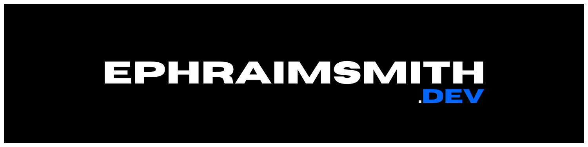

## **OBJECTIVE**

Build my corner of the internet where I share stuff I build and trade knowledge with people from all over the world.

## **MVP FUNCTIONALITY**

- projects page
- resources page
- basic nav

- [ ] basic nav: projects, social, resources
- [ ] landing page
- [ ] site meta
- [ ] projects page
- [ ] resources page

## **Brad Traversy**  

## **Kevin Cunningham**  

## **Articles**

- [Importing SVGs to Next.js](https://dev.to/dolearning/importing-svgs-to-next-js-nna)

## **Courses**

- [Next.js - Dev to Deployment](https://www.udemy.com/course/nextjs-dev-to-deployment/)

## **Docs**

- [Next.js](https://nextjs.org/docs/getting-started)

## **Videos**

- 
